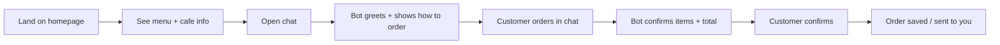

# Cafe MVP — Workflow & Scope

A focused plan for a cafe site with **one homepage** and **ordering via chatbot only** — no cart UI, no checkout forms on the page.

## MVP Goal

> A beautiful cafe landing page where customers browse the vibe and menu, then order by chatting.

Low UI surface area, one clear interaction path.

---

## What's In vs Out

| In MVP | Out (for later) |
|--------|------------------|
| Homepage (hero, menu highlights, hours, location) | Full menu pages with filters |
| Floating chat widget | Account / login |
| Chatbot takes orders in natural language | Payment integration |
| Simple order summary in chat | Payment integration |
| "Order sent" confirmation | Kitchen display / POS sync |

> **Prototype available:** Static HTML mockups in [`prototype/`](../prototype/). **React app** (current build): run `npm run dev` at project root — `/` customer site, `/admin` orders & menu.

---

## User Flow

### Example Chat Flow

1. **Bot:** "Hi! I can help you order. What would you like?"
2. **Customer:** "2 cappuccinos and a croissant"
3. **Bot:** "Got it — 2× Cappuccino ($8), 1× Croissant ($4). Total $20. Pickup or delivery?"
4. **Customer:** "Pickup, name is Alex"
5. **Bot:** "Order #1042 confirmed. Ready in ~15 min."

---

## Homepage (Minimal)

One scrollable page with four sections:

1. **Hero** — cafe name, tagline, one CTA: "Order via chat"
2. **Featured menu** — 6–8 items (not the full catalog; chat handles the rest)
3. **About / vibe** — short story + photo
4. **Visit** — hours, address, map link

No "Add to cart" buttons. The CTA always opens the chatbot.

---

## Chatbot MVP

Treat the bot as a **conversational order form**, not a general AI assistant.

### Bot Capabilities (MVP)

- Greet and explain how to order
- Understand item + quantity from plain text
- Ask only what's missing: pickup/delivery, name, phone (optional)
- Show order summary and ask for confirmation
- On confirm → save order (DB, Google Sheet, or email)

### Backend Options

| Option | Effort | Good for |
|--------|--------|----------|
| **A. Rule-based bot + small API** | Low | Fast demo, predictable |
| **B. LLM + structured menu JSON** | Medium | Natural language, still controlled |
| **C. No-code (Tidio, Voiceflow, etc.)** | Lowest | Prototype in days |

**Recommendation for MVP:** Option **B** — homepage you own + LLM that reads a fixed `menu.json` and outputs structured orders.

---

## Build Order

### Phase 1 — Design (1–2 days)

- Wireframe homepage in Figma (optional)
- Define menu JSON (name, price, category, available)
- Script 3–5 example order conversations

### Phase 2 — Homepage (2–3 days)

- Static or Next.js/React single page
- Mobile-first
- Chat bubble fixed bottom-right

### Phase 3 — Chatbot (3–4 days)

- Chat UI (messages in/out)
- Backend endpoint: `POST /api/chat` with conversation + menu context
- Order extraction → validate against menu → confirm → store

### Phase 4 — Polish (1 day)

- Loading states, error handling ("We don't have that item — try…")
- Simple order log (Supabase/Firebase or Airtable)

**Estimated total:** ~1–2 weeks for one developer; less if using a no-code bot.

---

## Suggested Tech Stack

| Layer | Choice |
|-------|--------|
| Frontend | Next.js or Vite + React |
| Styling | Tailwind |
| Chat | Custom widget + API |
| AI | OpenAI / Anthropic with strict system prompt + menu in context |
| Orders | Supabase (free tier) — `orders` table with JSON line items |
| Deploy | Vercel |

---

## Figma + Code Workflow (Optional)

1. **Figma first** — homepage only (hero, menu cards, chat FAB)
2. **Build homepage** to match
3. **Chat UI** can be coded without Figma (simple message list + input)

Use Figma for the **marketing page**, not for every chat state.

---

## MVP Success Criteria

You're done when someone can:

1. Open the site on mobile
2. Understand what the cafe is in ~10 seconds
3. Open chat and place an order in under 2 minutes
4. You receive/store that order reliably

---

## Early Decision: How Orders Reach You (v1)

Pick one before building the bot backend:

| Method | Pros |
|--------|------|
| **Email** | Fastest, no database |
| **Google Sheet** | Easy to scan during service |
| **Supabase** | Best if you'll add an admin panel later |

---

## Open Items (Fill In)

- [ ] Cafe name: _______________
- [ ] Vibe (e.g. cozy Italian, modern specialty coffee): _______________
- [ ] Order delivery method (email / sheet / database): _______________
- [ ] Pickup only or delivery too: _______________
